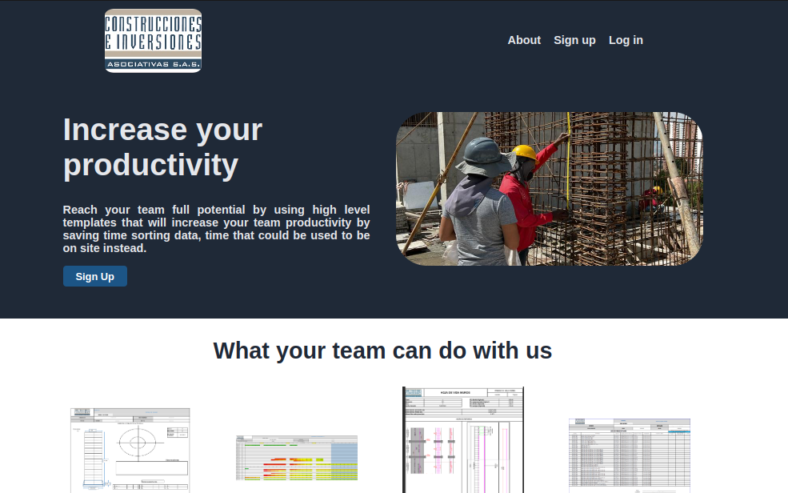
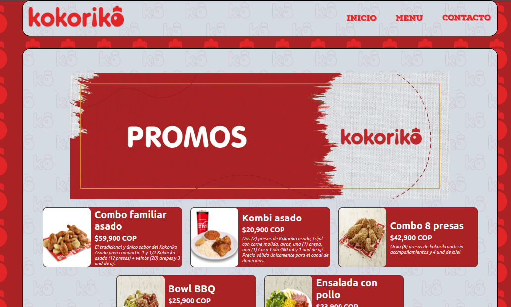
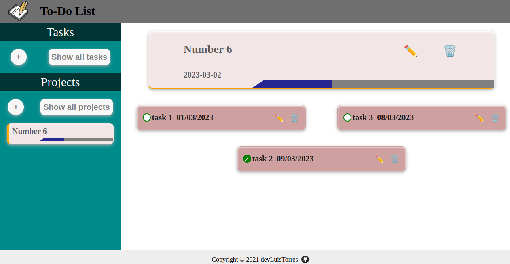
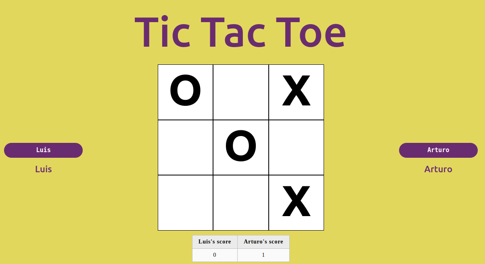

# 👋 Hi!

    I'm a Full Stack Development student who enjoys using JavaScript tools. I'm currently concentrating all of my mental energy on learning everything I can about web development. I also enjoy learning about new technology that I may use to address problems in the real world.

 

# 👷 What can my previous formation in civil engineer offer?

<ul align="justify">
  <li>Attention to detail</li>
  <li>Project management skills</li>
  <li>Problem-solving skills</li>
  <li>Teamwork and collaboration</li>
</ul>

# 🔧 Technologies & Tools

<table>
  <tr>
    <td align="center" height="108" width="108">
      
       <strong>HTML</strong>
    </td>
    <td align="center" height="108" width="108">
      
       <strong>CSS</strong>
    </td>
    <td align="center" height="108" width="108">
      
       <strong>JS</strong>
    </td>
    <td align="center" height="108" width="108">
      
       <strong>React</strong>
    </td>
    <td align="center" height="108" width="108">
      
       <strong>Webpack</strong>
    </td>
    <td align="center" height="108" width="108">
      
       <strong>Github</strong>
    </td>
    <td align="center" height="108" width="108">
      
       <strong>Sass</strong>
    </td>
  </tr>
</table>

# 🌟 Favorite vanilla javascript projects

<table>
  <tr>
    <td align="center" height="108" width="108">
      
       <strong>Etch-a-Sketch</strong>
    </td>
    <td align="center" height="108" width="108">
      
       <strong>Demo Civil engineering</strong>
    </td>
    <td align="center" height="108" width="108">
      
       <strong>Restaurant page</strong>
    </td>
    <td align="center" height="108" width="108">
      
       <strong>To do list</strong>
    </td>
        <td align="center" height="108" width="108">
      
       <strong>Weather app</strong>
    </td>
    <td align="center" height="108" width="108">
      
       <strong>Tic-tac-toe</strong>
    </td>
  </tr>
</table>

# ⚛️ Favorite react projects

<table>
  <tr>
    <td align="center" height="108" width="108">
      
       <strong>CV project</strong>
    </td>
  </tr>
</table>

# 📈 Stats

 

